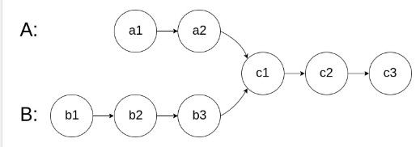

> 题目及解法来源于代码随想录，本文为记录本人的一些思考
# 双指针
## 基础
- 快慢双指针，朝同一方向遍历
- 首尾双指针，从两边向中间遍历
---
### 移除元素
https://leetcode.cn/problems/remove-element/description/  
原地移除数组中所有值等于val的元素   
使用快慢双指针，一个遍历原数组，一个遍历新数组

---
### 替换数字
https://kamacoder.com/problempage.php?pid=1064    
将字符串中的数字替换成'number'   
移除元素由于是减少元素的，所以一前一后遍历即可（新数组比旧数组慢），但是本题是会使得元素增加的，则新数组的增长比旧数组快  
为此，可以逆转思路，从尾部遍历，从后往前，这样旧数组就在新数组的前面了。  
先遍历一遍，计算新数组的总数，然后双指针分别指向新旧数组的末尾，从后往前遍历即可。  

---
### 反转字符串
https://leetcode.cn/problems/reverse-string/description/  
原地反转字符串   
最基础的反转题，使用首尾双指针，将两边互换，即可反转  

---
### 翻转字符串里的单词
https://leetcode.cn/problems/reverse-words-in-a-string/description/  
单词的顺序反转，且删去多余空格   
可以先删去多余的空格，在数组中删除指定元素，直接用快慢双指针。   
之后是单词顺序**反转**，如果要原地反转，不难想到反转字符串中的首尾双指针，但是这样做，是反转整个句子，单词字母也反转了，为此，可以把单词再反转一次，再次使用首尾双指针（放在单词的首尾），将每个单词反转，就实现了顺序反转。   

---
### 反转链表
https://leetcode.cn/problems/reverse-linked-list/description/  
将链表的Next指针反转即可，为了反转后能找到下一个节点，不能想到用两个指针  

---
### 删除链表中的倒数第n个节点
https://leetcode.cn/problems/remove-nth-node-from-end-of-list/description/  
一趟扫描，实现删除倒数第n个   
也就是，要提前知道哪个是倒数第n个，当扫描到末尾时，还能找到倒数第n个节点。与反转链表一样，要同时知道两个节点，用双指针即可。先让快指针往前遍历n个节点，然后再让快慢指针同时往前遍历。

---
### 链表相交
https://leetcode.cn/problems/intersection-of-two-linked-lists-lcci/description/  
两个链表在某一节点之后都指向相同的节点（合并为同一链表），求出这个相交的节点。

既然相交之后都是相同的链表，那么如果从后往前比较，显然很容易找出开始相同的那个节点，可惜不是双向链表。      

其实原题的图已经给了暗示，假如我们把末尾对齐，然后两个指针都从较短的链表的开头所对应的节点开始，从前往后遍历，第一个相等的节点即为相交的节点。   

---
### 环形链表II
https://leetcode.cn/problems/linked-list-cycle-ii/description/   
求某链表有没有环，并且求环开始的位置。   
当有环的时候怎么检测呢，如果直接遍历，必然是死循环，进入环后不可能再出来，所以必然要想办法<u>在环内检测出环</u>。   
<u>环的特性是首尾相接</u>，即前面出发的绕了n周后可以追上后出发的。故而，使用快慢两指针，假如快指针最终与慢指针相遇，即为有环，为了使快指针一定能刚好和慢指针相遇，可以使它们的相对速度为1。   

---
### 三数之和&&四数之和
https://leetcode.cn/problems/3sum/  
https://leetcode.cn/problems/4sum/  
使得n个数相加等于某个数。套路都是一样的，先排序一遍，首尾向中间遍历，寻找等于target的组合。用这个方法一般只能降一个次幂的复杂度。（题目中需要注意剪枝和去重）   

---
### 总结 & 碎碎念
双指针的遍历方法基本上区分就是同一方向还是不同方向：
- 同一方向
    - 从后往前
    - 从前往后
- 不同方向
    - 首尾向中间

本章的题目都是前面有的，凭着记忆重新写了遍笔记后，感觉思路清晰了不少，果然还是得多整理