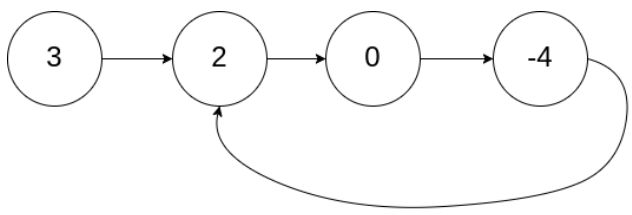
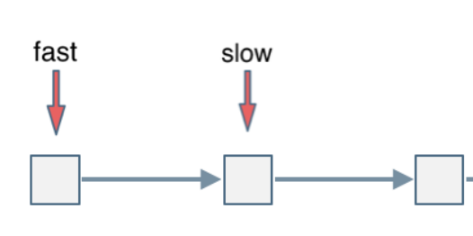
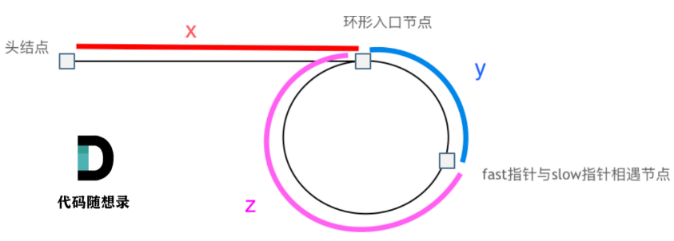

> 题目及解法来源于代码随想录，本文为记录本人的一些思考
# 链表
---
## 基础
分类：  
- 单链表
- 双链表（双向链表）
- 循环链表

**虚拟头节点**：  
为了保证不必对头节点做特殊处理，一开始就设立一个不带任何数据的虚拟头节点  
大部分链表分类的题目里，使用虚拟头节点都可以提高做题效率，防止遗漏特殊情况  

---
## 反转链表
https://leetcode.cn/problems/reverse-linked-list/  
在原链表基础上反转链表，直接使用*双指针*即可

---
## 删除倒数第N个节点
https://leetcode.cn/problems/remove-nth-node-from-end-of-list/  
使用**双指针**来解决。  
由于链表的特性，无法得知结尾在哪，如果要一次得出结果，那么需要在遍历到结尾时知道倒数第N个节点，即知道两个节点————使用快慢双指针来解决。  
使快指针先遍历N+1个节点，再同步移动快慢指针即可。

---
## 环形链表
https://leetcode.cn/problems/linked-list-cycle-ii/  
确定是否有环，有环则返回环的入口  

  
方法：    

- 哈希表
- 双指针（快慢指针）
### 哈希表
重点是找到第一个**重复**的元素，可以直接用set**查重**。  
使用unordered_set(内部实现为哈希表)，进行查重
### 双指针
当有环时，使用快慢指针，当碰面时必然是有环。  
为此，设置快指针每次移动两格，慢指针每次移动一格。  
当快慢指针都进入环后，可以看作<u>快指针追逐慢指针，相对速度为1</u>，所以，快指针每次以一格接近慢指针，最终必然达成：  

 
最终必然是以快指针追上慢指针结束。  
有环时，则要计算环的起点的位置：  

  
此处省略一堆数学计算...     

---
