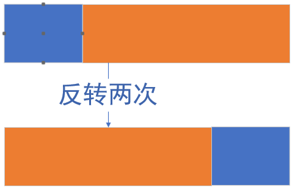
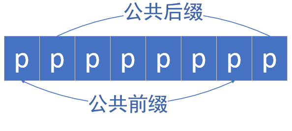

> 题目及解法来源于代码随想录，本文为记录本人的一些思考
# 字符串
---
## 基础
### KMP算法(有多种实现，自己推一遍印象更深)
用于子串匹配  
用于计算出现失配时，下次从哪里开始匹配，减少重复的匹配工作  
主串的每个字符仅需计算一次，时间复杂度为O(m+n)（m,n分别为模式串与主串的长度）  
重点为前缀表与next数组
#### 前缀表与next数组
模式串的最长公共前后缀（前缀*不包含最后一个字符*，后缀*不包含第一个字符*）  
计算**next数组**（next[i]指*第i-1位*的公共前后缀长度，也是i号位失配时，模式串下一个需要匹配的索引）：  
- 初始化
    - j指向前缀末尾，i指向后缀末尾
- 循环遍历(i,j都需加1)
    - 当前后缀（p[i]与p[j]）相同时
        - 将前缀j+1赋值给next数组，注意无公共前后缀的情况
    - 当前后缀不同时
        - 相当于模式串在第j位失配，j指针回退（<u>只有指向前缀的指针回退</u>）

c++代码如下：
```cpp
i=1;
j=0;
nxt[0]=nxt[1]=0;   // 前两位失配，下一次都需要从第0位开始匹配
while(i<pLen){
    while(j && p[j]!=p[i]) j=nxt[j];  // 注意j!=0的退出条件。nxt数组是模式串失配时，下一个需要匹配的索引，所以直接令j=nxt[j]
    nxt[i+1]=(p[j]==p[i]?++j:0);   // nxt[i]是i-1位的公共前后缀长度。当不相等时，即为无公共前后缀，赋值为0。当相等时，需要赋值j+1，同时前缀j需要后移，匹配下一项
    i++;
}
```
#### 实际匹配
使用next数组进行匹配，第j位失配时，则用next[j]进行匹配  
```cpp
i=j=0; // i指向主串str，j指向模式串p   str与i，j与p是成对出现的，不要写混
while(j<pLen && i<strLen){  // 当模式串没有完全匹配
    while(j && p[j]!=str[i]) j=nxt[j];   // 回退模式串的指针
    if(str[i]==p[j]){
        j++;
    }
    i++;   // 指向主串的指针一直前进，无论是否匹配，都只会计算一次
}
```
#### tips
搞清楚谁在回退，谁在前进。前缀的指针与模式串的指针可能会回退，而后缀的指针与主串的指针一直在前进。  
KMP在具体细节上有多种实现，不同的next数组的计算对应着不同的实际匹配

---
## 反转字符串
https://leetcode.cn/problems/reverse-string/submissions/615571417/  
给定一个字符串，在原字符串上反转，不能有额外空间分配  
### 解
需要在原字符串上反转，由于是头尾反转，所以可以想到双指针
## 替换数字
https://kamacoder.com/problempage.php?pid=1064  
将输入字符串中的数字替换为'number'  
数组填充类解法：  
**提前扩容，从后往前操作**  
首先统计数字的个数，提前扩容，使用双指针，从后往前遍历新旧数组

---
## 反转字符串中的单词
https://leetcode.cn/problems/reverse-words-in-a-string/description/  
给定字符串句子，使句子中的单词顺序反转，删去多余的空格，并且空间复杂度为O(1)  
### 解
分三步走  
- 首先去除多余空格（不要和其他步骤混杂，会搞晕的）
    - 在数组中，去除所有的指定元素，使用快慢**双指针**法
- 反转整个句子
- 反转单词
在之前已做过反转字符串，字符串反转后再反转单词，那么就相当于单词顺序反转了  
## 右旋字符串
https://kamacoder.com/problempage.php?pid=1065  
将字符串的最后k个字符调到最前面，O(1)的额外空间复杂度  
### 解
与之前的反转字符串中的单词一样，要求<u>调换子数组的位置，且子数组内的排序不变</u>，可以采用**整体反转+局部反转**，反转两次后，就可以前后调换子数组的位置了。  
<p align="center">

</p>

---
## 匹配模式串
https://leetcode.cn/problems/find-the-index-of-the-first-occurrence-in-a-string/  
KMP秒了

---
## 重复的子字符串
https://leetcode.cn/problems/repeated-substring-pattern/  
判断一个字符串能否由其字串重复n次后构成   
### 解
- 暴力
- 移动匹配
- KMP

**暴力求解**的话，由于只需要知道终止位置就可以（该<u>子串必然要从第一个字符开头</u>），判断的时候也是一次遍历即可，所以是O(n^2)，复杂度并不算很高。  
**移动匹配**的思路是：将原字符s串首尾相连，构成ss，并去掉第一个和最后一个字符（防止误判），如果能在其中找到子串s，则满足要求。该方法需要在ss里匹配s，要么也使用KMP，要么调库函数（如contains，find，不同语言库函数实现不同，一般复杂度为O(m+n)）   
#### KMP算法
主要思路为：如果一个字符串s可以由其子串重复n次组成，那么其最长公共前后缀不包含的子串一定是s的最小重复子串（注意，前缀不包含最后一个字符，后缀也不包含第一个字符），如下图：  
<p align=center></p>

由图也可以看出，s的长度必然可以整除该最小子串。而反过来，假如已知s的长度可以整除该子串p，那么，就可以将前缀划分为长度相等的块p1,p2,....pn。p等于pn，进而等于pn-1（比对前后缀的位置即可得出）  
所以计算方法如下(时间复杂度为O(n)) ：(next表实现不同，索引上会有差异) 
- 计算next表
- 根据next[len]得到最长公共前后缀
- 计算len能否整除(len-next[len])

而我自己的思路如下（非常麻烦，只是留个档）：假如可以由某子串重复构成，那么他就一定是在公共的前后缀里，所以可以先计算next表，获取整个字符串的公共前后缀，然后，计算该公共前后缀是否能重复n次组成s，不能的话，获取该前缀的公共前后缀（前缀的公共前后缀与后缀的公共前后缀是相同的，即可以得到前缀的前缀与后缀的后缀），继续计算。   

---
## 总结
- 双指针
- 反转
    - 整体反转与局部反转
- KMP