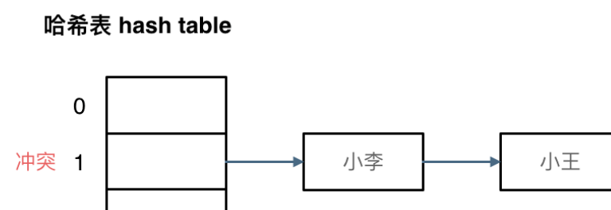
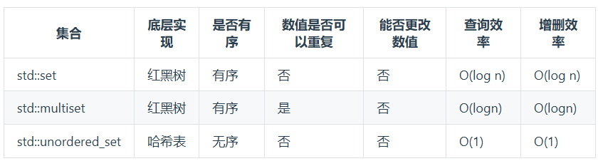
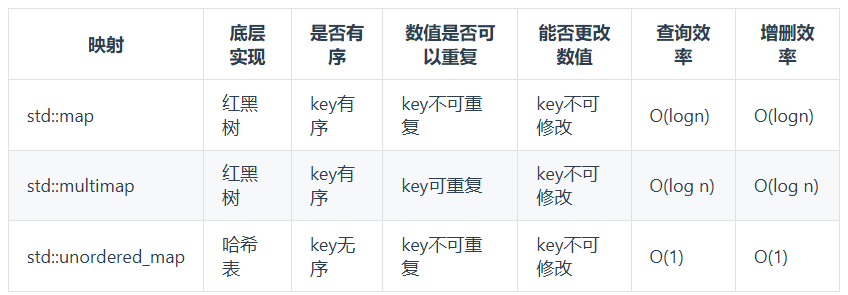

# 哈希表
又名散列表。  
一般用于快速判断一个**元素是否出现**在集合里。  
使用**哈希函数**把关键码映射到哈希表上，```hashFunction=hashCode(name)%tableSize```

---
## 基础
### 哈希碰撞
解决方法：  
- 拉链法
- 线性探测法
#### 拉链法
发生碰撞的元素被存储在链表中  
<p align=center></p>

#### 线性探测法
一定要保证tableSize > dataSize，依靠哈希表中的空位解决碰撞问题。  
### 常见的哈希结构
数组、set(unordered_set)、map(unordered_map)
#### set与map
set底层实现及优劣势如下：  
<p align=center></p>
map底层实现及优劣势如下：  
<p align=center></p>

set,multiset,map,multimap 底层为**红黑树**，而无序的unordered_set与unordered_map底层为哈希表，红黑树的key值是有序的，而哈希表是无序的（其排布是按哈希值映射，而非key值）。

---
## 两个数组的交集
https://leetcode.cn/problems/intersection-of-two-arrays/  
求取两个数组中相同的元素
### 方法
- unordered_set
- 数组
#### 数组
unordered_set非常方便于去重，但是对比起数组，它还需要做hash运算，且可能有更高的内存开销。故而，当题目有**规定数值范围**时，可以直接使用数组。

---
## 两数之和
https://leetcode.cn/problems/two-sum/  
给定一个数组与目标值，找出其中相加等于目标值的两个数。
### 方法
- 暴力破解
- 哈希map，根据加数与和求另一个加数
#### map
本题暴力破解很简单，像这样找两个数的，需要额外注意两个数的关联，是否<u>找到一个数即可唯一**确定另一个数**</u>  
在本题中，给出一个数，根据目标值即可确定另一个数，也就是说实际上不需要真的把数组两两相加，只需要确定数组中有无另一个加数，这时就可以使用map来记录已出现过的数。以此，可以达到O(n)的复杂度。

---
## 三数之和
https://leetcode.cn/problems/3sum/description/  
给定一个数组，返回三个数字，其和为0，不用返回下标，不指定顺序，三元组不能重复  
### 方法
- 哈希
- 双指针
由于本题不指定顺序与下标，可以先排序。哈希与双指针都是先指定第一个数，然后**转换为两数之和**，可以使用*unordered_set*去重。（双指针法中，需要把n都遍历一遍，不能找到一个解就停了）  
本题中，双指针法更为高效

---
## 四数之和
https://leetcode.cn/problems/4sum/description/  
给定一个数组，从中取四个数，使得其和等于目标值，不要求顺序与下标，不能重复。  
与两数之和、三数之和一个思路，使用双指针降复杂度，从O(n^4)到O(n^3)

---
## 四数之和(II)
https://leetcode.cn/problems/4sum-ii/description/  
给定四个数组，从其中各取出一个数，计算有多少个组合可以使四数之和为0  
本题与两数之和类似，首先可以想到分组，将其拆解为两数之和。  
由于题目只要求个数，所以可以开个map，来记录两数之和以及其出现的次数。  
首先遍历A、B两数组，求出其两数之和及出现的次数，然后遍历C、D两数组，看map中是否存有他们的和的负数。

---
## 赎金信||字母异位词
https://leetcode.cn/problems/ransom-note/description/  
https://leetcode.cn/problems/valid-anagram/  
两题都是判断一个单词中的字母是否可以构成另一字母，不要求顺序。这种情况就可以直接使用数组记录出现的字母的次数即可

