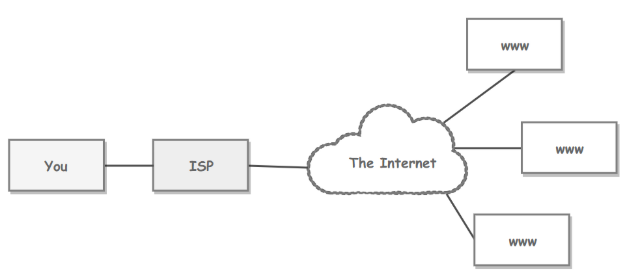
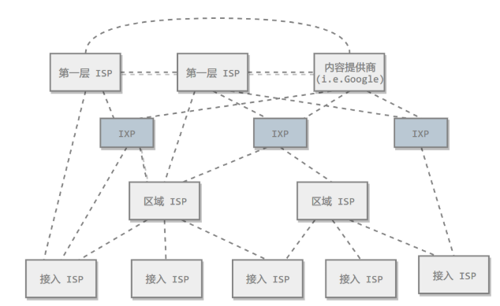
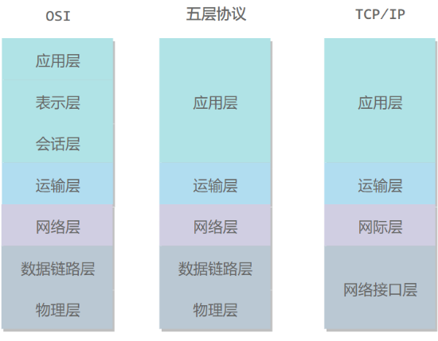
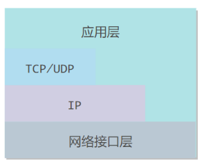

<style>
    img{
        width: 70%;
    }
</style>
# 概述
## 互联网（Internet）
网络(network)的网络
## ISP（网络服务提供商）
- ISP向互联网管理机构获取**IP地址**，并拥有通信线路和路由等**联网设备**
- 个人或机构向ISP缴纳一定费用即可接入网络  
  <div align="center" ></div>
- **多层次ISP**
  - 目前的互联网结构
  - 根据覆盖面积大小，分为：第一层ISP，区域ISP，接入ISP <p align="center"></p>
  - 两个ISP可通过互联网交换点IXP直接相连而不需通过第三个ISP
## 主机之间的通信方式
- 客户-服务器 C/S
- 对等 P2P
  - 不区分服务器和客户
## 电路交换和分组交换
- 电路交换
  - 用于电话通信系统
  - 要先建立**专用**的<u>物理链路</u>，且**一直占用**
  - 利用率低（因为通信时不可能一直使用传输线路）
- 分组交换
  - 每个分组有首部和尾部，存储源地址和目的地等控制信息
  - 同一传输路线允许传输多个分组，不需要占用线路
  - **存储转发**
## 时延
**总时延=传输时延+传播时延+处理时延+排队时延**  
- **传输时延**
  - 主机或路由器<u>传输数据帧</u>所需要的时间
    ```math
        delay=\frac{l(bit)}{v(bit/s)}
    ```
    其中，l为数据帧的长度，v为传输速率
- **传播时延**
  - *电磁波*（接近光速）在<u>信道上传播</u>所需花费的时间
    ```math
        delay=\frac{s(bit)}{v(bit/s)}
    ```
    s表示信道长度，v表示电磁波的传播速度
- **处理时延**
  - 主机或路由器收到分组后处理的时间
    - 如：分析首部、分组中提取数据、差错校验、查找路由
- **排队时延**
  - 分组在路由器的输入队列和输出队列中等待的时间
  - 取决于当前网络的通信量
## 计算机网络体系结构
<p align="center"> </p>

- 五层协议
  - 应用层
    - 为<u>应用程序</u>提供数据传输服务，数据单位为报文。如：http,dns
  - 传输层（运输层）
    - 为<u>进程</u>提供
    - 传输控制协议**TCP**
      - 面向连接、可靠
      - 单位为报文段
      - 完整性服务
    - 用户数据报协议**UDP**
      - 无连接、尽最大努力
      - 单位为用户数据报
      - 及时性服务
  - 网络层
    - 为<u>主机</u>提供
    - 把传输层的数据封装为**分组**
  - 数据链路层
    - <u>主机</u>之间
    - 封装为**帧**
  - 物理层
    - 考虑如何在传输媒体上传输数据比特流，而不是指具体的传输媒体
    - 作用为屏蔽传输媒体和通信手段的差异
- OSI
  - 表示层
    - 数据压缩、加密及数据描述，使应用程序不必关心不同主机中<u>数据格式</u>不同的问题
  - 会话层
    - 建立和管理会话
  - 五层协议中，把这些功能交给应用程序开发者处理
- TCP/IP
  - 只有四层
  - 把五层协议中的数据链路层和物理层合并为**网络接口层**
  - 不严格遵顼OSI分层概念，应用层可能会直接使用IP层或网络接口层
    <p align="center"> </p>
- 数据在各层间的传递
  - 向下时，添加首尾，向上中，不断拆开头部和尾部
  - 路由器只有下三层协议，不需要应用层和传输层（因为路由器位于网络核心中，不需要为进程或应用程序提供服务）